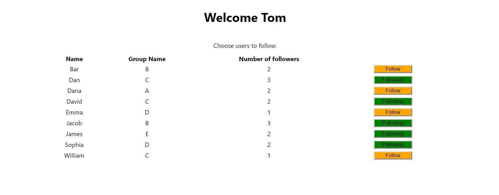
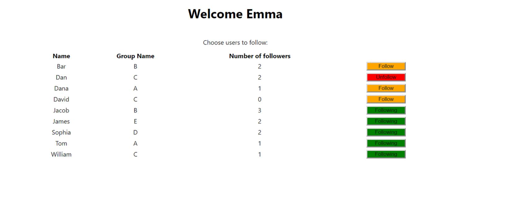

# Follow-User

A client/server app that shows different content if the user is logged in or out.

If user is logged out (not saved to localstorage),render:
"Must be signed in"
for example:

If logged in,render list that includes all users. for example:

## Tables in DB:

users(id,name,group_id)
groups(id,name)
followings(id,user_id,following_user_id)

## Follow/Unfollow button logic:
"Follow" (orange) - if the logged in user is not currently following the corresponding user.
 
"Following" (green) - If the user already follows the corresponding user. 
"Unfollow" (red) - When hovering on "Following": 

When the button is clicked,store the new state in the DB.
If the request succeeded-change the button color accordingly, if failed-show an error message.
